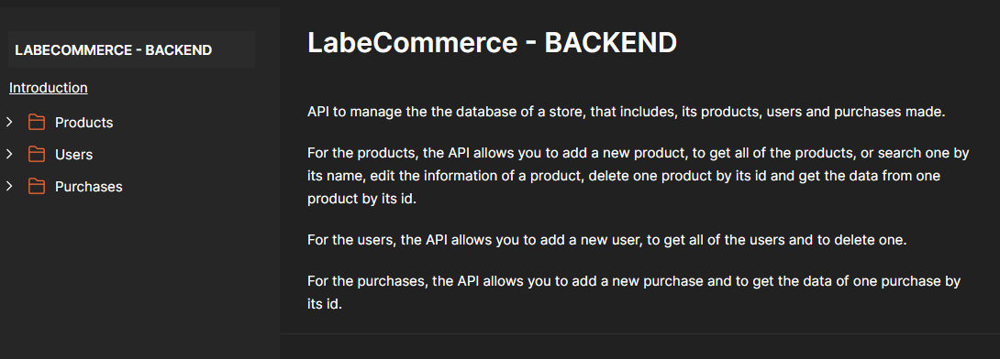

# API LabeCommerce - Backend



API to manage the the database of a store, that includes, its products, users and purchases made.

For the products, the API allows you to add a new product, to get all of the products, or search one by its name, edit the information of a product, delete one product by its id and get the data from one product by its id.

For the users, the API allows you to add a new user, to get all of the users and to delete one.

For the purchases, the API allows you to add a new purchase and to get the data of one purchase by its id.

[View the documentation](https://documenter.getpostman.com/view/26594436/2s93z3fQkE)

## Index
- <a href="#functionalities">Application functionalities</a>
- <a href="#demonstration">Demonstration</a>
- <a href="#run">How to run the application</a>
- <a href="#endpoints">Application endpoints</a>
- <a href="#tecnologies-used"> Tecnologies used</a>
- <a href="#developer">Developer</a>
- <a href="#next-steps">Next steps</a>

## Application functionalities
 - [x]  Get all users  
 - [x]  Create user
 - [x]  Delete user by id
 - [x]  Create product
 - [x]  Get all products 
 - [x]  Edit product by id
 - [x]  Create purchase
 - [x]  Delete purchase by id
 - [x]  Get purchase by id
  
## Demonstration

https://github.com/Julia-slvbrg/labecommerce-backend/assets/114543081/88acc1ce-3b0f-4e5f-bd93-1bdd2e6d003e

## How to run
```bash
# Clone this repository
$ git clone repolink

# Acess the app folder on your terminal
$ cd labecommerce-backend

# Install the dependencies
$ npm install

# Run the app 
$ npm run dev

# Use your prefered API test tool to run the application
```

## Application endpoints

1. Endpoints for the users table:
 - Get all users: 
    - app.get('/users', getAllUsers);
 - Create user
    - app.post('/users', createUser);
 - Delete user by id
    - app.delete('/users/:id', deleteUserById);

2. Endpoints for the products table:
 - Get productc by name
    - app.get('/product/search', getAllProducts);
 - Get product by id
    - app.get('/products/:id', getProductById);
 - Create product
    - app.post('/products', createProduct);
 - Delete product by id
    - app.delete('/products/:id', deleteProductById);
 - Edit product by id
    - app.put('/products/:id', editProductById);

3. Endpoints for the purchases table:
 - Create purchase
    - app.post('/purchases', createPurchase);
 - Get purchase by id
    - app.get('/purchases/:id', getPurchaseById);
 - Delete purchase by id
    - app.delete('/purchases/:id', deletePurchaseById);

## Tecnologies used
1. TypeScript
2. [Node.js](https://nodejs.org/en)
3. [Express](https://expressjs.com/pt-br/)
4. SQL
5. [SQLite](https://www.sqlite.org/index.html)
6. [Knex](https://knexjs.org/)

## Developer
[LinkedIn](https://www.linkedin.com/in/julia-silva-borges/)

## Next steps
 -[ ] Expand the database
 
 -[ ] Implement the API in a frontend application
